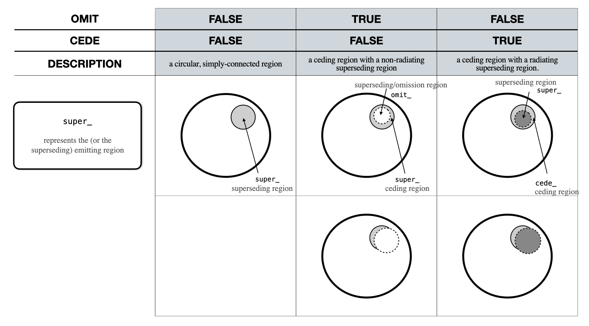

.. module:: xpsi.HotRegion

.. _hotregion:

HotRegion
=========

Instances of :class:`~.HotRegion.HotRegion` are objects representing radiatively
intense regions of the source photosphere.

Representation of the ``HotRegion`` class instantiation options ``omit`` and ``cede``. The image also shows the prefixes used for the instance attributes associated with each type of region constituting a ``HotRegion`` object.

.. figure:: _static/HotRegion_parameters.png
   :width: 600

Representation of a ``HotRegion`` instance configuration, when ``omit`` or ``cede`` are set to ``True``. A description of these parameters is also presented below. If ``is_antiphased = True``, the parameter ``phase_shift`` is added to :math:`\pi` radians. For example, if ``phase_shift = 0``, the omission or the superseding region (respectively on the left and right side of the image) is in anti-phase with the observer meridian (i.e., its azimuth is :math:`\pi`).

.. autoclass:: xpsi.HotRegion.HotRegion
    :members: __construct_cellMesh, __compute_rays,
              __compute_cellParamVecs, embed,
              psi, integrate, integrate_stokes, num_rays, sqrt_num_cells, leaves, phases,
              set_phases, phases_in_cycles, print_settings, num_cells,
              cede, concentric
    :show-inheritance:

.. autoclass:: xpsi.HotRegion.RayError
    :show-inheritance:

.. autoclass:: xpsi.HotRegion.PulseError
    :show-inheritance:
