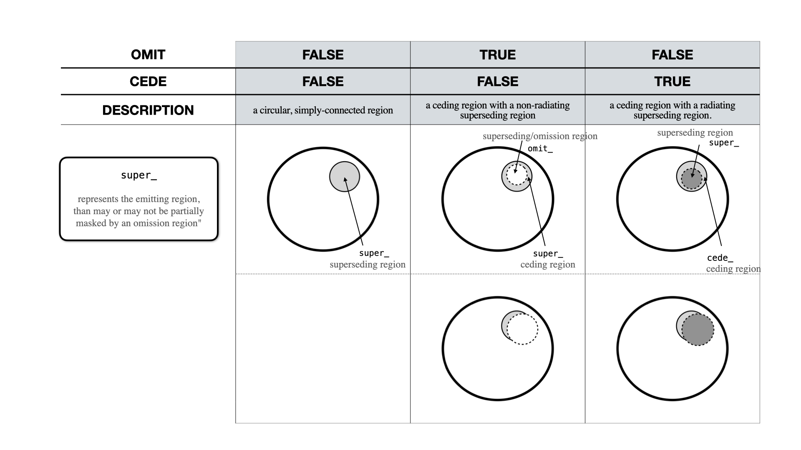

.. module:: xpsi.HotRegion

.. _hotregion:

HotRegion
=========

Instances of :class:`~.HotRegion.HotRegion` are objects representing radiatively
intense regions of the source photosphere.

Representation of the class instantiation options for the parameters `omit` and `cede` described below. 
The image also shows the prefixes used to describe the parameters within a HotRegion object.

.. figure:: images/HotRegion_parameters.png
   :width: 600

Representation of the parameters describing the HotRegion object, when `omit` or `cede` are set to ``True``.
A description of thes parameters is also presented below. 
If ``is_antiphased = True``, the parameter ``phase_shift`` is added to :math:`\pi`. 
For example, if ``phase_shift = 0``, the omission or the superseding region (respectively on the left and right side of the image) is in antiphase with the observer meridian (i.e. its azimuth is :math:`\pi`).

.. autoclass:: xpsi.HotRegion.HotRegion
    :members: _HotRegion__construct_cellMesh, _HotRegion__compute_rays,
              _HotRegion__compute_cellParamVecs, embed,
              psi, integrate, num_rays, sqrt_num_cells, leaves, phases,
              set_phases, phases_in_cycles, print_settings, num_cells,
              cede, concentric
    :show-inheritance:

.. autoclass:: xpsi.HotRegion.RayError
    :show-inheritance:

.. autoclass:: xpsi.HotRegion.PulseError
    :show-inheritance:
