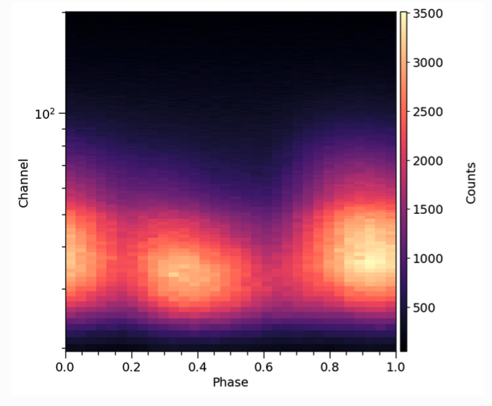

.. _overview:

Overview
========

Here we review the basic astrophysical and statistical aspects of modeling within X-PSI.  X-PSI is designed for the statistical analysis of *X-ray data* due to surface emission from rotating neutron stars, particularly for cases where this surface emission is not uniform, and  can therefore be *pulsed* due to rotational modulation.  This is then analysed within a Bayesian inference framework.   To do this we first need a physical model for *simulation* of data sets.   Together the data and model are then used as a basis for *likelihood function evaluation* and open-source software is then used for *posterior sampling*.  

Data
-------

Above is an example pulse profile data set, of the sort that X-PSI is typically used to analyse.  A pulse profile like this is created in the following way.  For every X-ray photon (or count) detected, the telescope records both its time of arrival and the energy channel in which it was detected.  Using the spin ephemeris of the pulsar, arrival time is mapped to rotational phase (the `clock` of the pulsar), and the photon assigned to a phase bin.  Over time the photons build up in phase bins and energy channels to form a pulse profile.  For further details of the process by which pulse profiles are generated from real telescope data, see for example `Bogdanov et al. (2019a) <https://ui.adsabs.harvard.edu/abs/2019ApJ...887L..25B/abstract>`_.  

Note that data sets may be built up over long periods of time, often from separate observations. In this case one needs to decide whether to combine data to form a single pulse profile (which may be reasonable if stellar properties do not change) or whether to analyse pulse profiles from individual data sets separately, allowing some parameters to vary.  Joint analysis of multiple X-ray data sets - both phase-resolved and phase-averaged - is possible within X-PSI (see e.g. `Riley et al. 2021 <https://ui.adsabs.harvard.edu/abs/2021ApJ...918L..27R/abstract>`_ for a joint analysis of phase-resolved NICER and phase-averaged XMM-Newton data).

Model (simulation)
-------------------------

We also need a model, encapsulating the relevant physical processes, that can simulate pulse profiles for a given set of model parameters.   Pulse profile modeling relies on the fact that emission from the stellar surface picks up imprints of the neutron star space-time - determined by mass, radius and spin - due to various relativistic effects.  The model therefore includes relativistic ray-tracing, describing how photons propagate from the surface of the neutron star through the space-time towards the distant observer. Mass and radius are two of the key unknown parameters (the spin, for pulsars, is known). For more details of the neutron star space-time model currently implemented in X-PSI, the Oblate Schwarzschild approximation of  `Morsink et al. (2007) <https://ui.adsabs.harvard.edu/abs/2007ApJ...663.1244M/abstract>`_, see `Bogdanov et al. (2019b) <https://ui.adsabs.harvard.edu/abs/2019ApJ...887L..26B/abstract>`_.  

However there are many other factors that determine the form of the pulse profile and which also need to be modelled:  e.g. the surface emission pattern (size, shape, temperature and location of the hot emitting regions), atmospheric beaming, observer inclination, distance and interstellar absorption.   To compare to real data we also need to know how the telescope records an instrument signal - its *response matrix*. Finally, we need to have a way of incorporating any source of emission that contributes to the pulse profile but which is not generated at the neutron star surface, such as astrophysical or instrumental background. For more information on how one builds a model for a specific astrophysical problem, see for example  `Bogdanov et al. (2021) <https://ui.adsabs.harvard.edu/abs/2021ApJ...914L..15B/abstract>`_, which discusses the case of the rotation-powered millisecond pulsars observed by NICER.  

A good model has to be sufficiently complex to explain the data adequately (something that can be tested using posterior checking, see below). However the elements of the model must also be implemented in a way that is sufficiently fast for parameter estimation to be tractable on a high-performance computing system.    

Likelihood function
------------------------------

A key element of Bayesian inference is the *likelihood function*, which is constructed from data and model. So let's translate the astrophysical issues mentioned above into more statistical language. The likelihood function has domain :math:`\mathbb{R}^{n}`, defined for each (model) parameter vector :math:`\boldsymbol{\theta}` (optionally with finite local prior probability density) by a parametrised sampling distribution on the space of the data evaluated at the *fixed* dataset :math:`\mathcal{D}`. The likelihood is defined by

.. math::

    L(\boldsymbol{\theta};\mathcal{M})\mathrel{:=}\mathcal{P}(\mathcal{D}\;|\;\boldsymbol{\theta},\mathcal{M}),

where :math:`\mathcal{M}` is the global (hierarchical) model.  We first need to consider our data set :math:`\mathcal{D}`: in general let it be constituted by some union of data subsets :math:`\mathcal{D}=\cup_{i}\mathcal{D}_{i}`, such that :math:`\mathcal{D}_{i}\cap\mathcal{D}_{j}=\emptyset` for :math:`i\neq j` (e.g. one NICER and one XMM-Newton data set), and the subsets are statistically independent---i.e., the joint sampling distribution conditional on the model is separable. We also assume that the data subsets :math:`\mathcal{D}_{i}` are acquired during mutually disjoint time intervals.  We describe the stochastic generation of this data via observations---with a model X-ray telescope---of a single model star, whose parameters (e.g. mass, radius, properties of the hot emitting regions) we are interested in constraining.  Poisson noise (a feature of X-ray detection) is also incorporated here.  For an example of how a likelihood function is formed in X-PSI, including details of how we typically handle background (via marginalization), see e.g. `Riley et al. (2021) <https://ui.adsabs.harvard.edu/abs/2021ApJ...918L..27R/abstract>`_.

We define a data subset :math:`\mathcal{D}_{i}` as having a parametrised model sampling distribution that is written in terms of a *single pulse*
generated by a rotating non-axisymmetric surface radiation field.\ [#]_ Further, let the radiation field be everywhere invariant in surface local comoving frames
(which need not necessarily be photospheric rest frames).  Photon events constituting :math:`\mathcal{D}_{i}` need not be acquired within a single
period of rotation of the star--- while the stars of interest are of galactic origin they are sufficiently distant that the incident flux of photons can be very small.

The photon events which comprise :math:`\mathcal{D}_{i}` can span an arbitrarily long time interval, but over that time interval the surface
radiation field is assumed to be stable. Each subset :math:`\mathcal{D}_{i}` is acquired with some model instrument with a response matrix (a photon energy redistribution matrix combined with an energy-dependent effective area vector) which is used to transform a radiation field incident on the telescope into a form which enters directly in the sampling distribution of :math:`\mathcal{D}_{i}`.

Priors
--------

Our *model* has many parameters (such as mass, radius, distance, inclination, and parameters that describe the hot regions).  We may also have other information, such as constraints on the background.  These are incorporated by defining priors.   Some may be very informative:  for pulsars in a binary system, for example, we may have excellent prior constraints on the mass from radio timing (see e.g.  `Reardon et al. 2024 <https://ui.adsabs.harvard.edu/abs/2024ApJ...971L..18R/abstract>`_).  Others may be much less informative.  For radius we typically use a joint flat prior formulation that encompasses the range permitted by all current equation of state models (`Riley, Raaijmakers & Watts 2018 <https://ui.adsabs.harvard.edu/abs/2018MNRAS.478.1093R/abstract>`_), with the goal of enabling unrestricted follow-on dense matter analysis (e.g. `Rutherford et al. 2024 <https://ui.adsabs.harvard.edu/abs/2024ApJ...971L..19R/abstract>`_).   And for hot emitting region properties we often consider a very wide range of prior space due to e.g. a lack of constraints from pulsar emission theory.  Determining the priors is an integral part of parameter estimation with X-PSI (but can be neglected if you only want to carry out pulse simulation).  

Posteriors
--------------

Finally, we arrive at the computation of posterior distributions for the model parameters.  For this, X-PSI couples to existing open source samplers such as `MultiNest <https://github.com/JohannesBuchner/MultiNest>`_ and `UltraNest <https://johannesbuchner.github.io/UltraNest/>`_.   The joint posterior distribution on parameter space is the joint probability density distribution proportional to the integrable product of the likelihood function with a joint prior distribution:

.. math::

    \mathcal{P}(\boldsymbol{\theta}\;|\;\mathcal{D},\mathcal{M},\mathcal{I})=\frac{L(\boldsymbol{\theta};\mathcal{M})\mathcal{P}(\boldsymbol{\theta}\;|\;\mathcal{M},\mathcal{I})}{\mathcal{P}(\mathcal{D}\;|\;\mathcal{M},\mathcal{I})}

The normalisation is the prior predictive distribution on the space of the data evaluated at :math:`\mathcal{D}`:

.. math::

    \mathcal{P}(\mathcal{D}\;|\;\mathcal{M},\mathcal{I})
    =\mathop{\int}\mathcal{P}(\mathcal{D}\;|\;\boldsymbol{\theta},\mathcal{M})\mathcal{P}(\boldsymbol{\theta}\;|\;\mathcal{M},\mathcal{I})d^{n}\boldsymbol{\theta}.
   
Also termed the *evidence* or *fully marginal likelihood*, this normalisation can be approximated by a nested sampler such as MultiNest. Note however that the interpretation and robustness of the evidence in the context of model comparison is problem-dependent and a subject of much debate in the literature!   This also a good moment to assess the quality of the physical model, by looking at the pulse profiles resulting from e.g. the maximum posterior or maximum likelihood parameter vector.  If there are significant deviations from the data, this may indicate a problem in the model.

Parallelisation and compute requirements
-------------------------------------------------------

X-PSI inherits the MPI parallelisation of an external sampling package. In general it is necessary to run X-PSI posterior sampling/integration on
distributed memory architectures (e.g., a cluster or a supercomputer) because likelihood evaluation times are slow, of :math:`\mathcal{O}(1)\,s`.

In addition, the source code for pulse simulation (required for likelihood evaluation) is OpenMP-enabled, meaning that in principle one can
explore hybrid parallelisation paradigms---in particular, enabling multithreaded computation on shared memory nodes of distributed architectures.

.. rubric:: Footnotes

.. [#] Note that X-PSI can also be used to simulate an axisymmetric surface radiation field - in which case the resulting emission would not be pulsed, but would incorporate relativistic effects due to rotation. 
